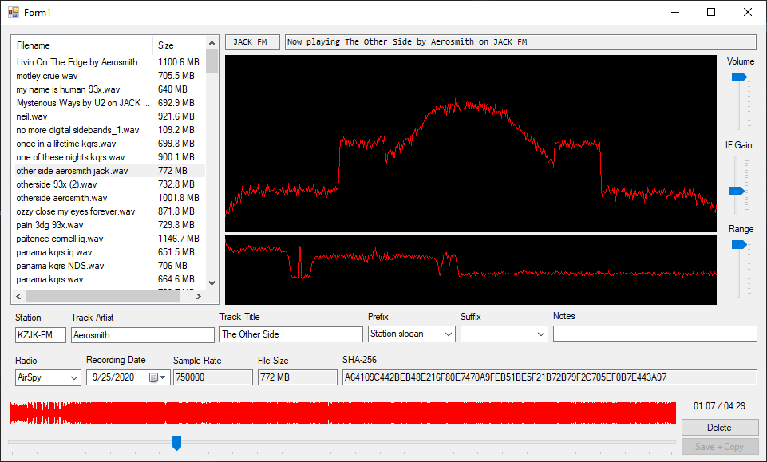

# LibSDR
LibSDR is easy to use, low latency, and modular Software Defined Radio library, fully written in C# .NET code with no external dependencies or processes.

Much of LibSDR's codebase is based on MIT licensed [SDRSharp](https://github.com/cgommel/sdrsharp), but it does not require any linking to it.

While LibSDR does not perform nearly as fast as some alternatives, including GNURadio and SDRSharp, it wasn't designed with this in mind. It's designed to be an easy to use, portable, modular library for doing SDR work. It does not deal with very high sample rates (3 MSPS and beyond) very well. It runs almost entirely on a single thread, so multicore processors will not improve performance, unfortunately.

## Usage
LibSDR has two main ways of usage. For most uses, the ``SDRRadio`` class can be used to let the library handle everything for you. Or, you can use each of the modules to build your own implementation.

### Using SDRRadio
This is the way most users will use this library. The library will handle almost everything for you, and all you need to do is provide a source, an output, and a demodulator.

To get started, first create the ``SDRRadio`` object. This takes in a configuration. All configuration options have a default value, but it's recommended to overwrite them with your own. View the configuration section for more info.

```csharp
SDRRadio radio = new SDRRadio(new SDRRadioConfig
{
    bufferSize = 16384,
    outputAudioSampleRate = 48000,
    realtime = false
});
```

Now, open your output. For this example, we'll use a .WAV file as an output. Use a ``WavReceiver`` and specify to use 16 bits per sample. You can use 8 and 32 as well, but 32 is overkill.

```csharp
FileStream outputFile = new FileStream("E:\\test_demod_audio.wav", FileMode.Create);
WavReceiver output = new WavReceiver(outputFile, 16);
```

Now, open your input. We'll use an IQ file for this example. View the input section for more info.

```csharp
FileStream sourceFile = new FileStream("E:\\KQRS-FM - Led Zeppelin - Whole Lotta Love.wav", FileMode.Open);
WavStreamSource source = new WavStreamSource(sourceFile, false, 0);
```

Next, create the demodulator. This is the class that will actually produce your output audio. For this example, we'll use wideband broadcast FM. Some demodulators have special options, functions, or events. Wideband FM, for example, has RDS related functions you can use.

```csharp
WbFmDemodulator demodulator = new WbFmDemodulator();
```

Finally, open the radio and apply the modules. We specify ``250000`` when setting the demodulator because that is the demodulation bandwidth we'd like to use. You only really need a sample rate that high when using wideband FM.

```csharp
radio.OpenRadio(source);
radio.AddDemodReceiver(output);
radio.SetDemodulator(demodulator, 250000);
```

The radio is now running! You can view the full example in the ``RomanPort.LibSDRTests`` folder.

### Using Individual Modules
For lower level access, you can also use individual demodulators, filters, resamplers, and other tools provided in the library. These aren't used as often, so aren't as well documented.

## SDRRadio Configuration
Here is a table of properties you can set in the SDRRadio configuration, passed in when you create an ``SDRRadio`` object:

| Name                  | Type     | Default   | Description                                                                                            |
|-----------------------|----------|-----------|--------------------------------------------------------------------------------------------------------|
| bufferSize            | ``int``  | ``4096``  | Buffer size. Higher is faster, but will introduce more latency and consume more memory.                |
| outputAudioSampleRate | ``int``  | ``48000`` | Sample rate of the output audio. Will always be in stereo.                                             |
| realtime              | ``bool`` | ``false`` | If set to true, the system will automatically throttle output demodulated audio to the requested rate. |

Once the SDRRadio object is created, you can also enable a few other modules inside of it by calling an ``Enable___`` function below:

* ``EnableFFT`` - Returns an object you can use to get the FFT of the incoming data.

## Codebase
LibSDR is split into a small number of projects for ease of use. There are two main projects in this repository, and two projects you can use as an example:

* ``RomanPort.LibSDR`` - The main library containing everything you need to get started. This is all you really need.
* ``RomanPort.LibSDR.UI`` - This is a library that will **only work in .NET Framework**, but provides a few basic Windows Forms UserControls you can use.
* ``RomanPort.LibSDRTests`` - An example project that just demodulates a given file while showing the speed in the console.
* ``RomanPort.IQFileIndexingTool`` - An internal tool, written in WinForms, that I used to index some files. I proided it as sample code. It's where the banner for this file is captured from.

## Modules
Modules are individual components that can operate by themselves.

### IQ Sources
IQ Sources extend the ``IIQSource`` class and are what IQ samples are streamed from by ``SDRRadio``. The ``IHardwareSource`` subclass also exists for hardware to extend from. AirSpy supoprt is also planned soon. The following sources exist:

| Name                | Description                                                                                                                                                                                                                                                      |
|---------------------|------------------------------------------------------------------------------------------------------------------------------------------------------------------------------------------------------------------------------------------------------------------|
| ``WavSourceStream`` | Streams IQ from a .wav file stream.                                                                                                                                                                                                                              |
| ``RtlSdrSource``    | Streams data from an RTL-SDR, sort of work in progress. **IMPORTANT:** Requires that you obtain ``librtlsdr.dll`` (included with SDRSharp) to use. Also REQUIRES that you build in 32 bit mode to use, as the drivers only exist for Windows in 32 bit varients. |

### Demodulators
Demodulators are what decode IQ samples into usable audio. They may also provide additional functions for use by the user. They all extend the ``IDemodulator`` class.

| Name                | Description                                                                                                         |
|---------------------|---------------------------------------------------------------------------------------------------------------------|
| ``WbFmDemodulator`` | Wideband broadcast FM. Provides stereo audio, as well as RDS.                                                       |
| ``FmDemodulator``   | Narrowband FM demodulator. Essentially the same as the wideband variant, just without the extra bells and whistles. |

### Sample Receivers
Sample receivers take demodulated audio and output them somewhere. There are currently two, both implementing the ``IRadioSampleReceiver`` interface:

| Name               | Description                                                                       |
|--------------------|-----------------------------------------------------------------------------------|
| ``WavReceiver``    | Outputs to a WAV file.                                                            |
| ``FFPlayReceiver`` | Outputs to an audio device, using FFPlay. Requires FFPlay/FFMpeg to be installed. |